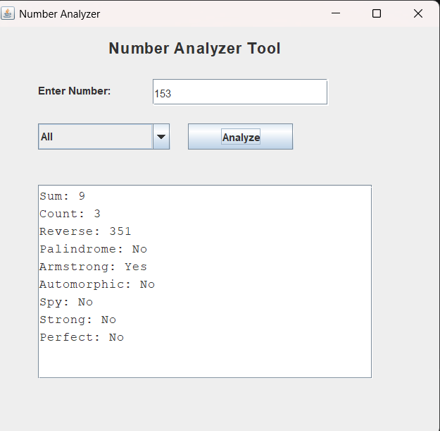

# Number Analyzer (Java GUI Project)

This is a simple Java GUI application that I built using Swing.  
It takes a number as input and performs different types of analysis on it using recursion.

While building this project, my main goal was to improve my logic-building skills and understand how recursion works in real problems.

---

## What this project does

The application can perform multiple operations on a number, such as:

- Finding the sum of digits  
- Counting total digits  
- Reversing the number  
- Checking whether the number is a palindrome  
- Checking Armstrong number  
- Checking Automorphic number  
- Checking Spy number  
- Checking Strong number  
- Checking Perfect number  

There is also an option to view all results together in a single click.

---

## Technologies used

- Java  
- Java Swing (for GUI)  
- Recursion  
- Event Handling (ActionListener)

---

## What I learned

Through this project, I learned:

- How to apply recursion in different number-based problems  
- Basics of building GUI using Java Swing  
- How to connect logic with user interface  
- Writing cleaner and more structured code  

This is one of my first projects where I combined logic + UI together.

---

## Project Screenshot

---

## How to run the project

1. Clone the repository:

2. Open the project in any Java IDE (like IntelliJ, Eclipse, or VS Code)

3. Compile and run: